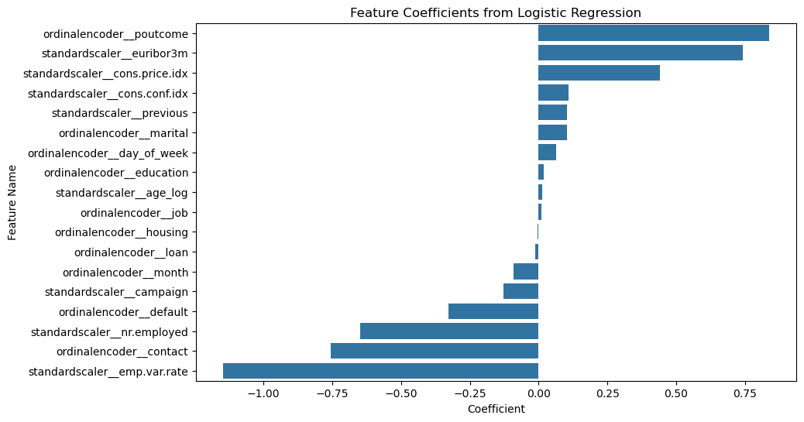
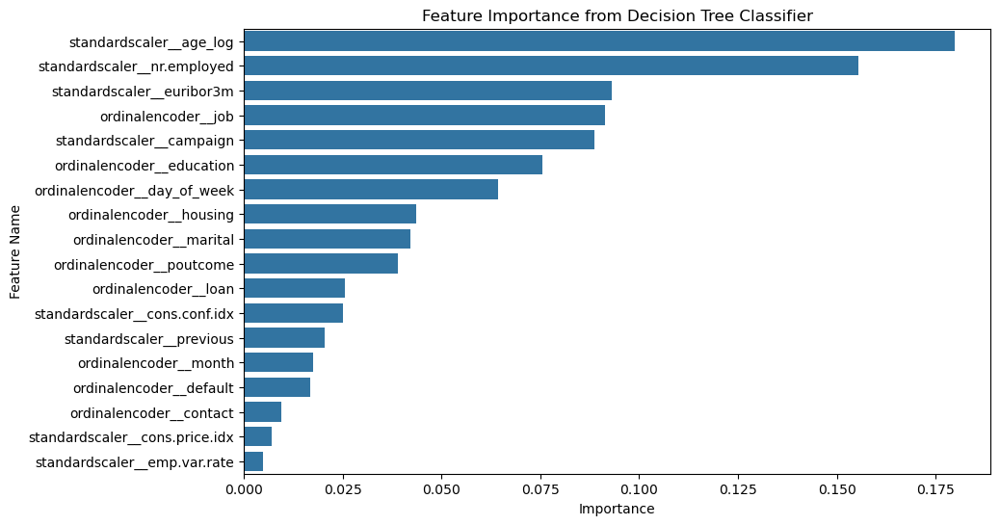

# Berkeley Haas - Professional Certificate in Machine Learning and Artificial Intelligence - Module 17 - Practical Application 3

<!-- TOC depthfrom:2 -->

- [Background](#background)
- [Business Objective](#business-objective)
- [Data](#data)
- [Research Jupyter Notebook](#research-jupyter-notebook)
- [Outcomes](#outcomes)

<!-- /TOC -->

## Background

This is a demonstration of application of skills learned during Part 2 of the program; Modules 12 to 16 - Classification Models.

## Business Objective  

What attributes enhance the chance the client will open an interest deposit account during a telemarketing campaign?

The scope of work is to build and evaluate predictive classification models to determine the success of the telemarketing campaign.

## Data

The dataset comes from the UCI Machine Learning repository [link](https://archive.ics.uci.edu/ml/datasets/bank+marketing). The data is from a Portuguese banking institution and is a collection of the results of multiple marketing campaigns.

The research paper states that the data represents 17 marketing campaigns by a Portuguese bank related to high interest deposit product. The campaign ran from May 2008 till November 2010. It consists of 79,354 contacts. Apparently with 8% (6,499) success rate. Meaning, customers accepting the offer. 

However, the actual dataset contains only 41,188 entries (half of the advertised amount in the paper).

## Jupyter Notebook

All the fine-level details of this research, such as EDA, model training, hyper-parameter tuning, model evaluation and feature importance analysis, can be found in the supporting Jupyter Notebook - [prompt_III.ipynb](prompt_III.ipynb)

## Outcomes

During EDA following interesting patterns have been found:
* Generally calls made during fall and winter months yield higher offer acceptance rate ~50%.  
* Previous successful engagement with the customer wins current call ~65%.
* Persistent calls from 3 to 5 times increase chance to even ~70%. More calls than that and the customer is less likely to respond positively.

After training a Logistic Regression model following important features were identified using model's coefficients:
* It is easier to predict failure of a call than a successful one.
* Age has little influence on classification. Also day of the week, month / season or education level.
* Previous positive śengagement (`poutcome`) has strongest positive influence on acceptance.
* Current socioeconomic trends are also very important factors in decision making. Euribor interest rates and price index influence customers to accept the offer, where as unemployment negatively influences the customers.

After training a Decision Tree Classifier model following important features were identified:
* Age plays most important role in this model. Where as in Logistic Regression it had minimal impact.
* Like in Logistic Regression, socioeconomic factors seem to play also significant role in Decision Tree Classifier.
* Strong employment and good Euribor interests rate are key attributes.

## Next Steps

* Use ensemble methods like Random Forest or Boosting.
* Use more advanced Feature Engineering techniques.
